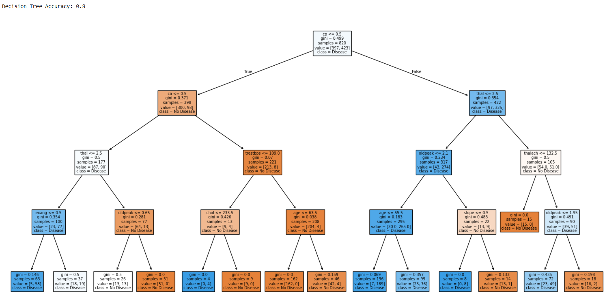
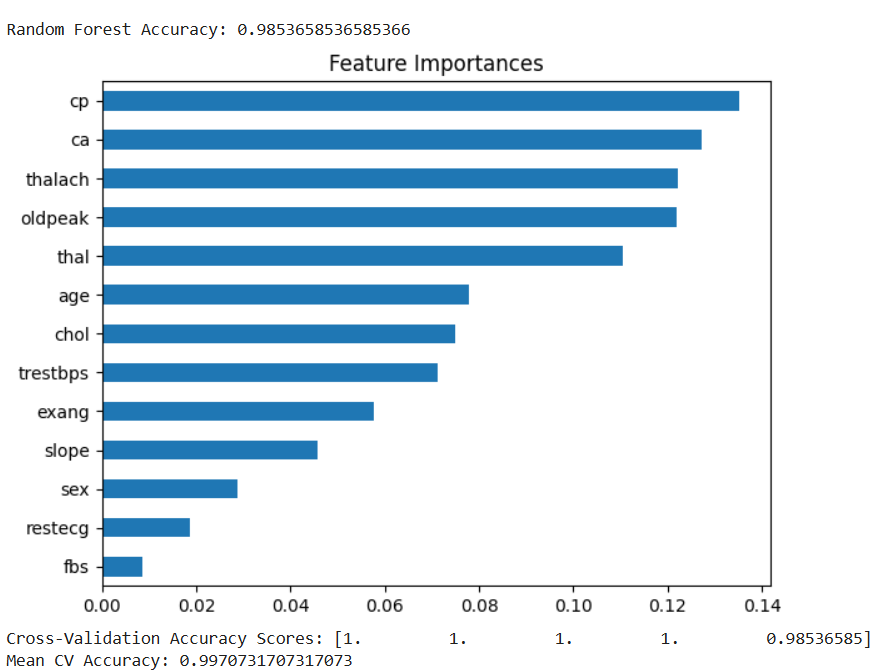

# Task 5 - Decision Trees and Random Forests 

This project is part of the AI & ML Internship and demonstrates the use of Decision Tree and Random Forest classifiers using the Heart Disease Dataset.

---

##  Objective

To learn and implement tree-based models for classification and understand key concepts like:

- Decision Trees
- Random Forests
- Feature Importance
- Cross-Validation
- Overfitting Control

---

##  Files Included

- `task5.py` – Main Python code containing all logic.
- `heart.csv` – Dataset used for training and testing.
- `task5-01.png`, `task5-02.png` – Screenshots of the decision tree visualization.
- `README.md` – This file.

---

##  Dataset

**Heart Disease Dataset**  
[Kaggle Link](https://www.kaggle.com/datasets/johnsmith88/heart-disease-dataset)

- 14 features including age, sex, chest pain type, cholesterol, etc.
- Target: Presence (`1`) or absence (`0`) of heart disease.

---

##  Tools & Libraries Used

- Python
- pandas
- scikit-learn
- matplotlib
- seaborn

---

##  Steps Performed

1. **Data Loading & Preprocessing**  
   - Loaded heart disease dataset
   - Split data into train/test sets

2. **Decision Tree Classifier**  
   - Trained with controlled `max_depth=4` to reduce overfitting  
   - Accuracy evaluated and tree visualized

3. **Random Forest Classifier**  
   - Trained with 100 trees  
   - Compared accuracy with Decision Tree

4. **Feature Importance**  
   - Visualized most important features from Random Forest

5. **Cross-Validation**  
   - Used 5-fold CV to evaluate model stability

---

##  Results

| Model           | Accuracy |
|----------------|----------|
| Decision Tree  | *~Value from your output* |
| Random Forest  | *~Value from your output* |

- Cross-validation Mean Accuracy: *~Value from your output*

---

##  Visualizations

  
*Decision Tree Structure*

  
*Random Forest Feature Importances*

---

##  Learning Outcomes

- Understood how decision trees split data using information gain
- Learned to reduce overfitting by controlling depth
- Saw how Random Forest improves performance through bagging
- Understood and visualized feature importance
- Validated results using cross-validation

---

